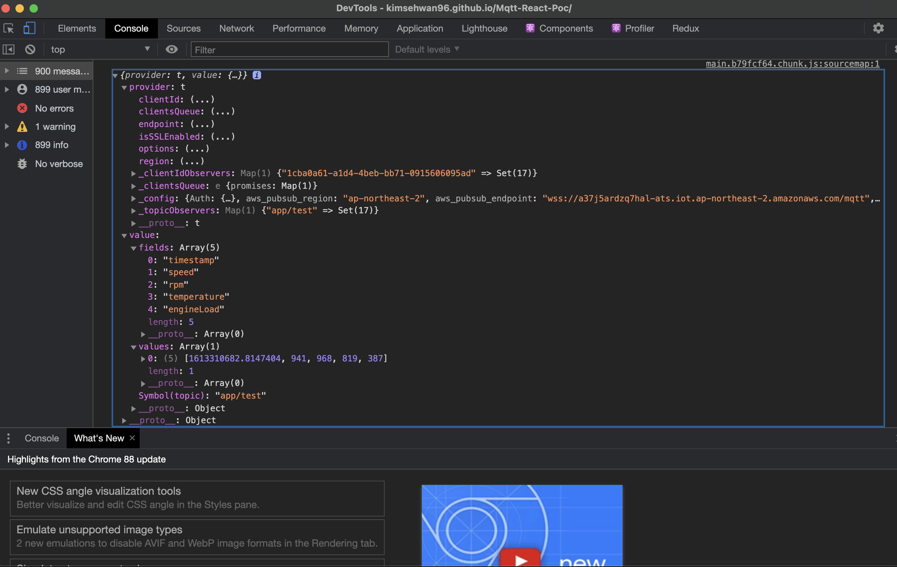

# Mqtt React POC 앱

- endpoint : a37j5ardzq7hal-ats.iot.ap-northeast-2.amazonaws.com

- ref : https://theskenengineering.com/building-a-react-js-app-with-aws-iot/


## 구조

- device에서 aws mqtt broker에게 데이터를 publishing
- react app은 적절한 cognito auth 절차 (현재는 인증 없이 풀어놓은 상태)를 거치고
- 인증 완료 이후 mqtt broker로부터 특정 topic을 Subscribe

- 현재 Python 코드는 ec2에서 디바이스 대신 데이터를 올리는 중.


https://kimsehwan96.github.io/Mqtt-React-Poc/

- 깃헙페이지로 배포 한 상태. 여기서 콘솔을 확인해보면..



- 이케 aws mqtt broker로부터 온 데이터를 확인 할 수 있다.

## front 구조

# prerequisites

- `npm install aws-amplify`

- `npm install aws-sdk`


## aws cognito auth

- aws sdk를 사용하기 위해서는. 누구의 플랫폼을 이용 할 것인지에 대한 인증이 필요하다.
- 이에 필요한 정보는 다음과 같다
    - 리전 (지역명 : ap-northeast-2)
    - cognito user pool id
    - cognito user pool client id (어떤 앱 클라이언트인지에 대한 내용)
    - cogntio identity pool id (코그니토 사용자 인증 풀 아이디, 여기서 권한등을 설정 할 수 있는데 우리는 poc용으로 비 인증 사용자에게도 모든 접근 허용)
    
- 추가적으로 aws iot broker를 사용하기 위해서는..
    - mqtt broker endpoint가 필요하다.
    
### awsConfig.json 내용

```json

{
  "region": "ap-northeast-2",
  "cognitoUserPoolId": "ap-northeast-2_0OJVDWgPa",
  "cognitoUserPoolClientId": "3siov6brjoecvq3d0djgrsohvd",
  "cognitoIdentityPoolId": "ap-northeast-2:b100e387-8238-4ac6-a1e2-5d18dd5ec77a",
  "mqttBrokerEndpoint": "a37j5ardzq7hal-ats.iot.ap-northeast-2.amazonaws.com"
}
```

- 설정에 대한 내용을 json 파일로 보통 관리함. 보안에 이슈가 큰 내용은 아님

### 최종 앱의 내용

```jsx
import Amplify, {PubSub} from 'aws-amplify';
import {AWSIoTProvider} from '@aws-amplify/pubsub/lib/Providers';
import awsConfig from './awsConfig.json'
import React, {useEffect, useState} from 'react';
import {makeStyles, useTheme} from '@material-ui/core/styles';
import Paper from '@material-ui/core/Paper';
import Grid from '@material-ui/core/Grid';
import {LineChart, Line, XAxis, YAxis, Label, ResponsiveContainer} from 'recharts';

function init(awsConfig) {
    Amplify.configure({
        Auth: {
            userPoolId: awsConfig.cognitoUserPoolId,
            userPoolWebClientId: awsConfig.cognitoUserPoolClientId,
            identityPoolId: awsConfig.cognitoIdentityPoolId,
            region: awsConfig.region,
        }
    });

    Amplify.addPluggable(new AWSIoTProvider({
        aws_pubsub_region: awsConfig.region,
        aws_pubsub_endpoint: `wss://${awsConfig.mqttBrokerEndpoint}/mqtt`,
    }));
}

const topic = 'app/test' //우리가 임의로 지정 할 수 있는 mqtt subscribe 토픽

const useStyles = makeStyles((theme) => ({
    root: {
        flexGrow: 1,
    },
    paper: {
        padding: theme.spacing(2),
        textAlign: 'center',
        color: theme.palette.text.primary,
    },
}));

const getTime = (unixTimestamp) => new Date((unixTimestamp + 3600 * 9) * 1000) //for korean time

function App() {

    init(awsConfig);
    const [fields, setFields] = useState([])
    const [values, setValues] = useState([0, 0, 0, 0, 0])
    const [provider, setProvider] = useState("");
    const classes = useStyles();

    useEffect(() => {
        PubSub.subscribe('app/test', {
            provider: 'AWSIoTProvider'
        }).subscribe({
            next: (data) => {
                setFields(data.value.fields);
                setValues(data.value.values);
                setProvider(JSON.stringify(data));
                console.log(data);
            },
            error: (error) => console.log(error)
        })
    })

    return (
        <Grid container spacing={3}>
            <Grid item xs={12}>
                <Paper className={classes.paper}> Hello world </Paper>
            </Grid>
            {
                fields.map((item, idx) => {
                    return (
                        <Grid item xs={4}>
                            <Paper className={classes.paper} variant="outlined" square>
                                <p> {item} </p>
                                <p> {(item === "timestamp") ? JSON.stringify(getTime(values[idx])) : values[idx]} </p>
                            </Paper>
                        </Grid>
                    );
                })
            }
            <Grid item xs={12}>
                <Paper className={classes.paper} variant="outlined" square>
                    <p> This is provider context </p>
                    <p> {provider} </p>
                </Paper>
            </Grid>
        </Grid>
    );
}

export default React.memo(App);

```


### 상세 설명

```jsx
import Amplify, {PubSub} from 'aws-amplify';
import {AWSIoTProvider} from '@aws-amplify/pubsub/lib/Providers';
import awsConfig from './awsConfig.json'
import React, {useEffect, useState} from 'react';
import {makeStyles, useTheme} from '@material-ui/core/styles';
import Paper from '@material-ui/core/Paper';
import Grid from '@material-ui/core/Grid';
import {LineChart, Line, XAxis, YAxis, Label, ResponsiveContainer} from 'recharts';

function init(awsConfig) {
    Amplify.configure({
        Auth: {
            userPoolId: awsConfig.cognitoUserPoolId,
            userPoolWebClientId: awsConfig.cognitoUserPoolClientId,
            identityPoolId: awsConfig.cognitoIdentityPoolId,
            region: awsConfig.region,
        }
    });

    Amplify.addPluggable(new AWSIoTProvider({
        aws_pubsub_region: awsConfig.region,
        aws_pubsub_endpoint: `wss://${awsConfig.mqttBrokerEndpoint}/mqtt`,
    }));
}

```

- `init` 함수를 만들었다. aws sdk를 사용하기 위한 인증 내용을 세팅하는 내용임.
- Amplify를 이용하여 특정 플랫폼 cognito와 연동하는 작업이라고 생각하면 된다.
- Amplify.addPluggable 같은 경우 추가적인 인증 내용을 삽입하는 것.
- 우리는 AWSIoTProvider 객체를 넣어서 AWS IOT 사용에 대한 인증을 수행
- endpoint는 wss 엔드포인트를 사용. TLS/SSL 로 보안 구현되어있음

```jsx
function App() {

    init(awsConfig);
    const [fields, setFields] = useState([])
    const [values, setValues] = useState([0, 0, 0, 0, 0])
    const [provider, setProvider] = useState("");
    const classes = useStyles();

    useEffect(() => {
        PubSub.subscribe('app/test', {
            provider: 'AWSIoTProvider'
        }).subscribe({
            next: (data) => {
                setFields(data.value.fields);
                setValues(data.value.values);
                setProvider(JSON.stringify(data));
                console.log(data);
            },
            error: (error) => console.log(error)
        })
    })

```

- PubSub의 subscribe 메서드를 사용하여 topic과 Provider를 명시함.
- 이후 subscribe 메서드를 한번 더 호출. next: 뒤에 사용하고자 하는 함수를 통헤ㅐ
- 데이터를 받거나 저장하면 된다.


## backend 구조

- poc 차원에서 간단하게 구현. ssl 인증을 위한 인증서를 사용한다.
- aws iot python sdk를 활용하여 aws iot broker에게 publish함
- 중간에 여러 설정 내용들이 있는데. 디폴트로 설정되어있는 내용들이 많음.
- greengrass 환경을 사용 할 경우 해당 내용 `yml` 형식으로 정의 가능.

```python3
import logging
import time
import json
from random import randint
from AWSIoTPythonSDK.MQTTLib import AWSIoTMQTTClient

host = 'a37j5ardzq7hal-ats.iot.ap-northeast-2.amazonaws.com'
port = 8883  # TLS SSL

rootCaPath = './root.pem'
certificatePath = './TestDevice_0214.cert.pem'
privateCertificatePath = './TestDevice_0214.private.key'

clientId = 'iotconsole-{}'.format(randint(1, 5000))

topic = 'app/test'

AllowedActions = ['both', 'publish', 'subscribe']

logger = logging.getLogger("AWSIoTPythonSDK.core")
logger.setLevel(logging.DEBUG)
streamHandler = logging.StreamHandler()
formatter = logging.Formatter('%(asctime)s - %(name)s - %(levelname)s - %(message)s')
streamHandler.setFormatter(formatter)
logger.addHandler(streamHandler)

myAWSIoTMQTTClient = None
myAWSIoTMQTTClient = AWSIoTMQTTClient(clientId)
myAWSIoTMQTTClient.configureEndpoint(host, port)
myAWSIoTMQTTClient.configureCredentials(rootCaPath, privateCertificatePath, certificatePath)

myAWSIoTMQTTClient.configureAutoReconnectBackoffTime(1, 32, 20)
myAWSIoTMQTTClient.configureOfflinePublishQueueing(-1)  # Infinite offline Publish queueing
myAWSIoTMQTTClient.configureDrainingFrequency(2)  # Draining: 2 Hz
myAWSIoTMQTTClient.configureConnectDisconnectTimeout(10)  # 10 sec
myAWSIoTMQTTClient.configureMQTTOperationTimeout(5)  # 5 sec

myAWSIoTMQTTClient.connect()

loopCount = 0


def make_message(rand_randge: tuple) -> dict:
    message = {
        "fields": [
            "timestamp",
            "speed",
            "rpm",
            "temperature",
            "engineLoad"
        ],
        "values": [
                time.time(),
                randint(*rand_randge),
                randint(*rand_randge),
                randint(*rand_randge),
                randint(*rand_randge)
        ]
    }

    return message


while True:
    myAWSIoTMQTTClient.publish(topic, json.dumps(make_message((1, 1000))), 1)
    print("published.")
    time.sleep(1)
    ```