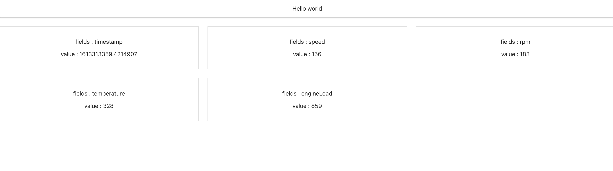

# Mqtt React POC 앱

- endpoint : a37j5ardzq7hal-ats.iot.ap-northeast-2.amazonaws.com

- ref : https://theskenengineering.com/building-a-react-js-app-with-aws-iot/

## 구조

- device에서 aws mqtt broker에게 데이터를 publishing
- react app은 적절한 cognito auth 절차 (현재는 인증 없이 풀어놓은 상태)를 거치고
- 인증 완료 이후 mqtt broker로부터 특정 topic을 Subscribe

- 현재 Python 코드는 ec2에서 디바이스 대신 데이터를 올리는 중.

https://kimsehwan96.github.io/Mqtt-React-Poc/

- 깃헙페이지로 배포 한 상태. 여기서 콘솔을 확인해보면..

- 이케 aws mqtt broker로부터 온 데이터를 확인 할 수 있다.